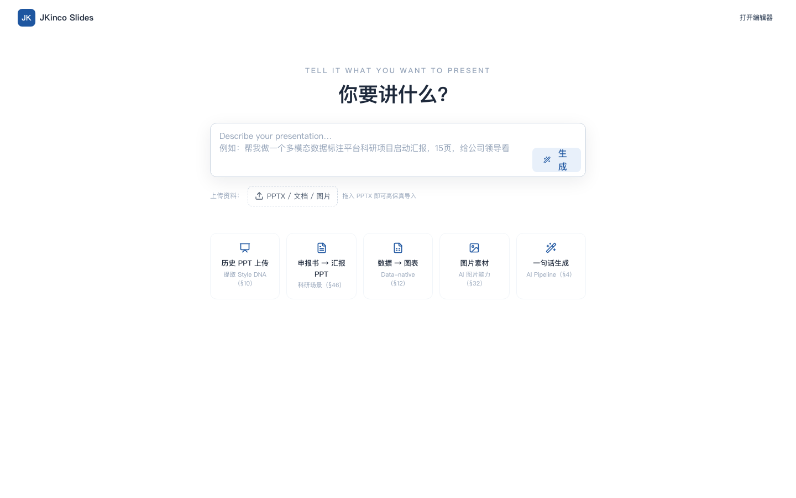

<p align="center">
  <a href="https://github.com/wenxuanzhang1209-cyber/jkinco-slides/actions/workflows/ci.yml"></a>
  
  
  
  
</p>

# JKinco Slides

**An AI-native presentation studio where every object stays editable — and PPTX survives the round trip.**

<sub>AI 原生的演示文稿工作台：每个对象都可编辑，PPTX 进出不失真。</sub>



---

## Why this exists

AI slide generators have a common failure mode: they hand you an image, or a rigid template,
or markup that collapses the moment you try to move one box. The generation is impressive and
the *editing* is where it falls apart — which is a problem, because nobody ships the first
draft.

And when you export to PPTX to finish the job in PowerPoint, text has usually become a
picture of text.

JKinco Slides treats the deck as a **semantic scene graph**, not pixels:

- **Every object stays a real object.** Move it, restyle it, let AI rewrite just that one —
  the rest of the deck does not shift underneath you.
- **Every edit is a command with an inverse.** `validate → execute → inverse`, so undo is
  exact rather than approximate, and AI edits go through the same path a human edit does.
- **PPTX round trip preserves types.** Exported text is still text; exported shapes are still
  shapes. Import grades each element as `native` / `preview` / `unsupported` and **never
  silently corrupts** what it cannot represent.

<sub>AI 生成 PPT 常见的失败方式是：给你一张图、一个死模板，或是一挪就散架的标记。
生成很惊艳，垮在**编辑**上——而没人会直接用第一稿。导出到 PPTX 之后，文字往往变成了
文字的图片。这个项目把演示文稿当作**语义场景图**而不是像素来处理。</sub>

## What's inside

18 packages, each independently testable:

| Layer | Packages |
|---|---|
| **Document core** | `scene-schema` · `command-engine` · `slide-engine` · `rich-text` |
| **Layout & visuals** | `layout-engine` (10 semantic patterns + constraint solver) · `diagram-engine` (10 layout algorithms) · `chart-engine` (data-native, ECharts) · `renderer` (SVG / print HTML) |
| **Quality & brand** | `qa-engine` (geometry / typography / content checks + auto-fix) · `style-engine` · `brand-engine` (logo, fonts, watermark, lock rules) · `design-system` |
| **AI** | `ai-sdk` (pluggable providers, **deterministic offline fallback**) · `ai-planner` (deck graph → storyboard → progressive generation) · `ai-editor` (scoped edits: object / selection / slide / section / deck) |
| **Interop & collaboration** | `pptx-export` · `pptx-import` · `collaboration` (Yjs CRDT command log + presence) |

## Quick start

Requires Node ≥ 20 and pnpm 9.

```bash
pnpm install
pnpm --filter @jkinco/web dev      # http://localhost:4173
```

Everything else:

```bash
pnpm -r test                       # 269 unit tests
pnpm -r typecheck
pnpm --filter @jkinco/web build
pnpm --filter @jkinco/web test:e2e # Playwright — run `npx playwright install chromium` first
```

## Design decisions worth knowing

**The AI layer has a deterministic offline fallback.** Every AI feature degrades to a
rule-based path when no model is configured, so the editor stays usable — and the test suite
runs without a network or an API key.

**Import never fails silently.** A PPTX element that cannot be represented natively is graded
`preview` or `unsupported` rather than quietly dropped. Losing a shape without being told is
worse than being told the shape is only approximate.

**Undo is derived, not recorded.** Each command computes its own inverse, so undo cannot drift
out of sync with the operation it is undoing.

## Status

Working implementation with CI (install → typecheck) and 269 passing unit tests. Single
maintainer; issues and pull requests are welcome.

<sub>已实现并有 CI（安装 → 类型检查）与 269 个通过的单元测试。单人维护，欢迎 Issue 与 PR。</sub>

## License

[MIT](LICENSE) © 2026 JKinco

---

<sub>
<b>JKinco</b> — local-first tools for work whose data cannot leave the building ·
<a href="https://github.com/wenxuanzhang1209-cyber/jkinco-listen-open">Listen</a> ·
<a href="https://github.com/wenxuanzhang1209-cyber/jkinco-slides">Slides</a> ·
<a href="https://github.com/wenxuanzhang1209-cyber/JKinco-Skills-Lab">Skills Lab</a> ·
<a href="https://github.com/wenxuanzhang1209-cyber/personal-life-hub">Life Hub</a> ·
<a href="https://github.com/wenxuanzhang1209-cyber/jkinco-tools">Tools</a>
</sub>
